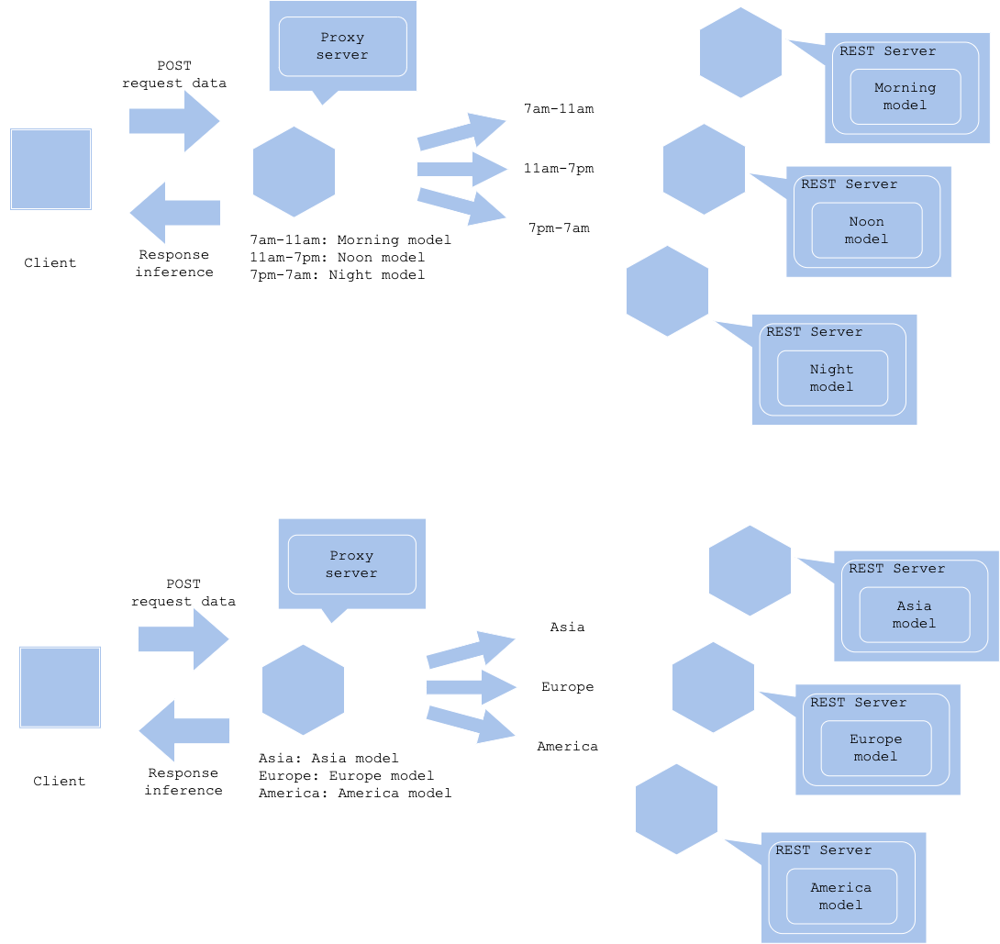

# Condition-based serving pattern

## Usecase
- 상황 따라 예측해야 할 대상이 다양한 경우. 
- 룰 베이스의 방식으로 상황에 따라 모델을 선택해야 하는 경우.

## Architecture
condition-based serving pattern은 상황에 따라 모델을 선택하는 구조입니다. 사용자의 상태(시간, 장소, 페르소나 등)에 따라 예측 대상이 바뀔 수 있는 경우들이 있습니다. 예를 들어, 고객에게 메뉴를 추천하기 위해 머신러닝 모델을 사용하는 경우, 스테이크나 와인을 아침 메뉴로 추천하는 것은 적절한 추천은 아닐 것입니다. 다른 예로. 카메라를 이용하여 랜드마크 빌딩을 분류하는 제품이 있을 경우, 일본에 있는 다리를 샌프란시스코의 금문교로 분류할 확률을 매우 낮을 것입니다. 예측을 하는 상황에 따라 타겟 변수를 구분할 수 있습니다. 
각 상황에 따라 맞는 사용할 모델을 사용하도록 개발해야 합니다. 각 모델에 대한 선택과 분산 처리는 프록시를 통해 제어합니다. 사용 사례에 따라서 선택하는 규칙이 달라질 수 있습니다. 예를 들어, 시간을 기준으로 선택할 경우, 아침 전용, 점심 전용, 저녁 전용, 야간 전용과 같이 나눌 수 있습니다. 이 경우, 모델 개발에서 난이도는 각 상황에 따라 변하는 문제의 범위와 타겟 변수가 어떻게 바뀌느냐에 따라 달라질 수 있습니다. 한 모델의 피쳐 엔지니어링을 다른 모델과 공유할 수 있는 경우라면, 각 조건에 대한 타겟 변수만 업데이트하면 됩니다. 만약 상황이 크게 달라져서 서로 공유할 수 없다면, 독자적인 모델을 만들거나 다른 패턴을 따를 수 있습니다. 각각의 상황에 대해 충분히 학습된 모델을 만들게 되므로, 범용적인 모델보다 더 좋은 결과를 기대할 수 있습니다. 
단, 모델수가 너무 많아지게 되면, 모델 평가, 개선, 운영에 필요한 작업량이 늘어나기 때문에 균형 잡힌 패턴을 선택하도록 고려해 봐야 할 수도 있습니다.  
상황을 구분하는 것은 모델 입력, 피쳐, 타겟에 따라 다양하게 달라질 수 있습니다. 경우에 따라서는 아침과 밤에 같은 모델을 사용하는 것이 적절할 수도 있습니다. 다른 한편으로는, 상황 구분에 대한 이해도에 따라 운영상 실수를 만들 수도 있습니다

## Diagram

## Pros
- 상황에 따라 알맞은 모델을 제공할 수 있습니다. 

## Cons
- 모델 수에 따라 운영 비용 증가.

## Needs consideration
- 상황을 구분하는 방법
- 모델 수와 모델 운영 사이의 균형

## Sample
https://github.com/shibuiwilliam/ml-system-in-actions/tree/main/chapter6_operation_management/condition_based_pattern