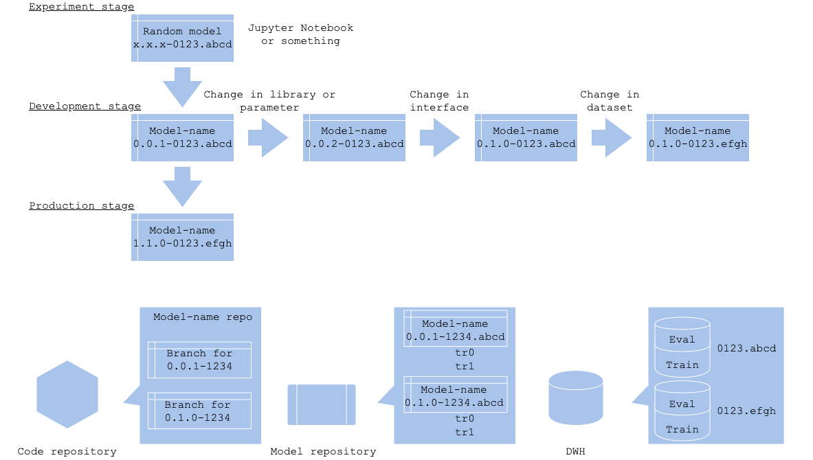

# [WIP] Data model versioning pattern

## Usecase
- 데이터와 모델 버전 관리를 해야 하는 경우(실제 운영 환경에서 머신러닝을 사용해야 하는 대부분의 경우)

## Architecture
 머신러닝 모델의 버전 관리는 어렵습니다. 그저 하나의 모델을 운영 환경 릴리즈하는 것만으로도 버전, 네이밍, 운영 등 다양한 요소들을 필요로 합니다. 

- 이 프로젝트에서 머신러닝을 사용하는 목적
  - 가치(주가 예측, 이상징후 감지, 얼굴 인식 등)
  - 기능(이미지 분류, 회귀, 랭킹 등)
- 릴리즈 버전
  - 사전 릴리즈
  - 릴리즈 
- 입력과 출력 데이터 및 인터페이스 
  - 입력 데이터 타입과 구조 
  - 출력 데이터 타입과 구조 
- 코드와 파이프라인
  - 학습 코드와 파이프라인
  - 예측 코드와 파이프라인
  - 코드와 파이프라인을 실행할 환경: 라이브러리, OS, 언어, 인프라와 그에 맞는 버전들
- 모델의 하이퍼파라미터
  - 알고리즘이나 라이브러리에 의존됨 
- 데이터
  - 데이터 검색 
  - 학습 및 테스트 데이터, 검증 데이터 분리 

학습과 예측을 재현할 수 있게 하려면, 위 구성 요소들의 버전들을 관리해야 합니다. 각 요소들은 주로 별도의 저장소나 데이터 웨어하우스로 관리되며 그 안에서 고유한 버전을 갖게 됩니다.  
아래는 버저닝 예시들입니다.  
`model-name x.y.z-data.split` 

- 모델 이름 (`MODEL-NAME x.y.z-data.split`)
- 릴리즈 버전 (`model-name X.y.z-data.split`)
- 인터페이스 버전 (`model-name x.Y.z-data.split`) : 입출력 인터페이스 버전
- 로직 버전 (`model-name x.y.Z-data.split`) : 알고리즘, 라이브러리, 하이퍼파라미터 등 
- 데이터 검색 버전 (`model-name x.y.z-DATA.split`) : 데이터를 검색 방법 
- 데이터 저장 버전 (`model-name x.y.z-data.SPLIT`) : 데이터를 분할 및 보완할 데이터 웨어하우스 버전 

#### 모델 이름 (`MODEL-NAME x.y.z-data.split`)
모델에 이름을 붙여주는 것은 중요합니다. 다른 사람들과 커뮤니케이션 하기 위해서는 모델을 특정할 수 있는 이름이 반드시 필요합니다. 또, 이름이 있어야 더 애정이 가는 법이죠. 이름 규칙은 팀 내에서 정의할 수도 있지만, 가치(주가 예측, 이상징후 감지, 얼굴 인식 등)나 기능(이미지 분류, 회귀, 리랭킹 등)에 따라 그 기준을 정하면 나중에 더 알아보기 좋습니다.  

#### 릴리즈 버전 (`model-name X.y.z-data.split`)
사전릴리즈(prerelease)와 릴리즈 두가지로 나눌 수 있습니다. 사전릴리즈 모델은 'model-name X.y.z-data.split'의 `X`를 `0`으로, 릴리즈 후에는 `1` 이상의 값을 사용합니다. 

#### 인터페이스 버전 (`model-name x.Y.z-data.split`)
 머신러닝 모델은 입력 데이터에 대해서 예측 결과를 출력합니다. 용도나 내부 알고리즘에 따라 다를 수 있지만, 대부분의 머신러닝 모델은 입력과 그에 대한 예측을 출력하는 방식이 보편적입니다. 입출력 구조가 변경되면 외부 인터페이스도 함께 변경해야 하므로, 외부 시스템과 인터페이스 버전을 함께 관리하는 것이 좋습니다. 인터페이스와, 데이터 타입 및 구조는 Git과 같은 코드 저장소를 이용하여 관리합니다. 스웨거나 프로토콜 버퍼를 사용하여 API 정의를 오픈하는 것도 좋습니다.  
 인터페이스 버저닝에서 입출력 인터페이스 버전만 관리하며, 내부 알고리즘, 라이브러리, 모델 평가는 고려하지 않습니다. 알고리즘과 라이브러리는 로직 버전에서, 모델 평가는 모델 저장소 내 모델 버전에서 관리합니다. 버전 규칙은 `0`으로 시작하여 입력 또는 출력이 바뀔 때마다 증가시켜 인터페이스 버전을 계속 고유하게 유지시켜줍니다.

#### 로직 버전 (`model-name x.y.Z-data.split`)
머신러닝의 학습이나 예측에는 최적화나 손실 함수 등 전처리와 예측 알고리즘이 다양하며, 그 실행 방법이나 튜닝 가능한 파라미터는 언어나 라이브러리에 따라 다를 수 있습니다. 로직 버전은 인터페이스 변경이 없는 전처리, 알고리즘, 라이브러리, 파라미터의 버저닝만을 담당합니다. 이러한 변경사항은 코드 레파지토리에서 브랜치로 관리됩니다. 실험 단계나 개발 단계에서는 모든 버전이 관리될 필요는 없습니다. 이때부터 시작하면 오히려 버전 관리가 더 어려워질 수 있습니다. 팀 리뷰가 가능하게 되었을 때부터 버전 관리를 시작하는 것이 좋습니다. 
알고리즘이나 파라미터가 같더라도, 학습에 의해 모델 평가나 손실에 격차가 발생하기도 합니다. 이 경우에는 모델 저장소애 학습 버전과 함께 평가를 저장할 수 있습니다. 학습에 의한 편차는 제어하기 어렵기 때문에 모델로서 버전 관리하는 것 보다는 학습과 평가를 세트로 관리하는 것이 좋습니다. 

#### 데이터 검색 (`model-name x.y.z-DATA.split`) 과 릴리즈 버전 (`model-name X.y.z-data.split`)
데이터는 일반적으로 데이터 웨어하우스에 저장됩니다. 학습에 사용하는 데이터는 학습 시 확정되기 때문에, 데이터를 학습용, 테스트용 그리고 평가용 데이터로 나누어 저장하는 것이 좋습니다. 데이터 버전 관리가 중요한 이유는 같은 데이터를 검색 및 학습, 테스트용 데이터와 섞이지 않음 으로써 비정상적인 평가를 막을 수 있기 때문입니다. 데이터 검색 방법과 데이터 세트 모두 버전 관리하여, 나중에 같은 데이터 세트에서 다시 검색할 수 있도록 관리하는 것이 좋습니다. 이와 함께, 검색된 데이터를 데이터 웨어하우스에 저장하는 것을 추천합니다. (정규화된 데이터라면 테이블 형식으로, 비 정규화된 데이터라면 zip 등의 객체 스토리지나 파일 스토리지로 저장할 수 있습니다.) 
데이터 버전 관리에는 데이터 검색 방법 버전(`model-name x.y.z-DATA.split`)과 분할 데이터 세트 버전(`model-name x.y.z-data.SPLIT`)이 필요합니다. 이 버전들은 증가하는 숫자보다는 문자열이나 생성 시간(timestamp)으로 버전 관리하는 것이 더 좋습니다. 데이터 검색 방법은 코드 레파지토리 조회 또는 데이터 파이프라인 정의를 통해, 데이터 세트는 데이터 웨어하우스에서 관리될 수 있습니다. 
 

---

인터페이스나 로직, 데이터 검색은 코드로 작성되기 때문이 이 역시 코드 레파지토리에 저장됩니다. 브랜치로 관리하면 자연스럽게 코드 저장소의 워크플로우(gitflow나 github flow)를 따를 수 있게 됩니다.  
출력된 모델 파일과 평가(및 학습)를 모델 레파지토리에 저장하는 것이 좋습니다. 문제는 모델 레파지토리에 대해 아직 표준화된 방법이 없으므로, 버전 관리를 위한 워크플로우를 직접 정의해야 할 수도 있습니다.  
데이터 세트는 데이터 웨어하우스나 스토리지에 보관하고, 버전에 맞는 테이블과 버킷 명을 사용하는 것이 관리에 용이합니다. 

## Diagram
### Versioning

### Version control in each stage

## Pros
- 모델 버전 관리 가능. 
- 모델 학습 재현을 위한 각종 요건 관리.
- 재학습 및 업데이트 관리. 

## Cons
- 코드, 모델, 데이터들을 여러 환경에서 관리해야 합니다. 

## Needs consideration
- 레파지토리와 데이터 웨어하우스 선택. 
- 워크플로우와 레파지토리, 데이터 웨어하우스 사용 방법.
