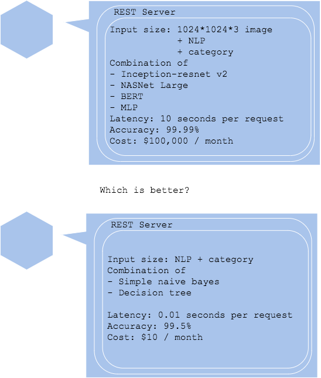

# Online bigsize pattern

## Case
- Condition when you deploy a bigsize model that takes long for an inference in an online service or system that require realtime response.
- Condition where average latency of predictions does not meet required performance.
- Condition where product of number of prediction and average latency is longer than expected completion in batch system.

## Situation
In any service, including web and batch, there is a requirement or expectation for time of completion for one task. For instance in a web service, the requirement might a mean time to respond for each request. For a batch system, completing processing of a hundred million records in 6 hours, midnight, would be a requirement. In any business and system, time is always limited and expensive that you cannot take everlasting time for one task. A standard and useful unit for cumulating time taken for task is average seconds taken for a prediction in machine learning system, and you have to design a model and prediction system to meet the requirement. Especially in a case of using a complex and gigantic deep learning model that may be time-consuming, you have to optimize somehow, or it will be impossible in web realtime services. You may try scale up or out to balance amount of process per server, though this can only be applied if unit inference responding time meets requirement. You may also try using an inference GPU, which may be costful than CPU. It is also a challenge, and might be the best choice, to make a simple model to meet the performance and latency. 
There is no best answer for taking a balance of model evaluation and speed tradeoff. It is important to define service level of the evaluation and speed according to business and system needs.

## Diagram

## Pros
- Evaluation may be better on a big and complex model.
- It is fun making a complex model.

## Cons
- Need to take balance of speed, cost and accuracy.
- It is also fun making a simple and reasonable model.

## Work around
- Define latency or speed required for business use or system to evaluate the model quality, not only of accuracy.
- Try using GPU, or scale out, if it is cost effective.

## Related design pattern
- [Prediction cache pattern](./../../Prediction-cache-pattern/design_en.md)
- [Data cache pattern](./../../Data-cache-pattern/design_en.md)
- [Loading test pattern](./../../../QA-patterns/Loading-test-pattern/design_en.md)
- [Prediction log pattern](./../../../Operation-patterns/Prediction-log-pattern/design_en.md)
- [Prediction monitoring pattern](./../../../Operation-patterns/Prediction-monitoring-pattern/design_en.md)