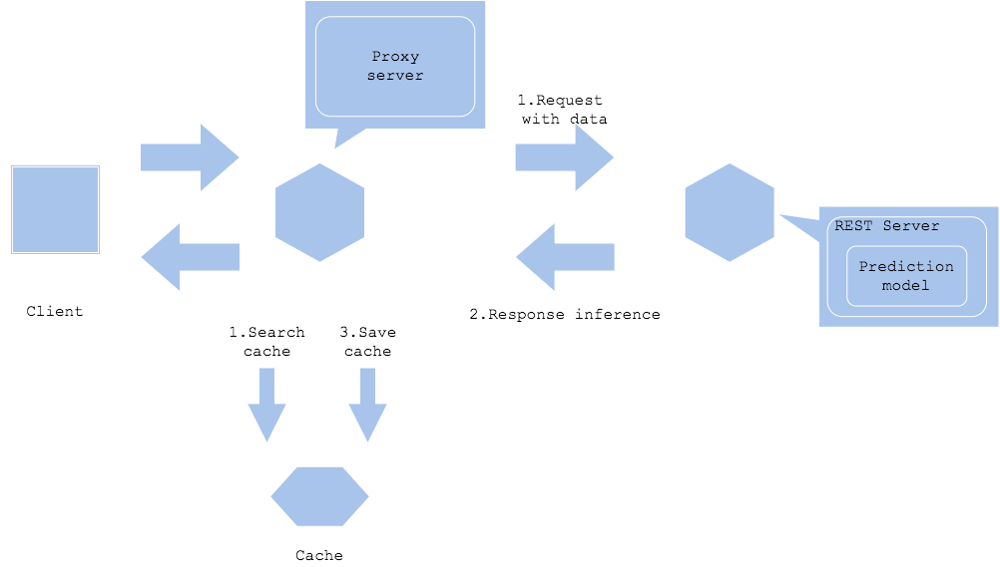

# Prediction cache pattern

## Usecase
- 同一データの推論リクエストが発生し、かつ同一データを同定できるワークフローの場合
- 推論結果が時間経過で変わる可能性が低いとき
- キャッシュのキーで検索可能な入力データの場合
- 推論を高速に処理したい場合

## Architecture
推論キャッシュ・パターンは推論結果をキャッシュに格納することで、同一データの推論をキャッシュ検索することができるようになります。同一データに対する推論が多く、入力データの同定をキャッシュキーで検索できる場合、推論キャッシュ・パターンは有効です。 
本パターンでは入力データがキャッシュに存在しない場合、推論後に入力データをキー、推論結果を値としてキャッシュに格納します。以降の推論では、キャッシュを検索と推論を同時に実行し、キャッシュにヒットした場合は推論のレスポンスを待たずに値をクライアントに返却します。機械学習の推論にかかる時間を短縮し、推論サーバへの負荷を削減することが期待できます。 
キャッシュするデータ量はキャッシュのコストや容量とトレードオフになります。多くのキャッシュはストレージ等よりもコストが高く、容量が小さい傾向にあるため、コスト・オーバー、容量オーバーを避けるためにキャッシュクリアの方針が必要です。 
推論結果が時間経過で変化するシステムの場合、定期的にキャッシュクリアして古いキャッシュを削除する必要があります。高アクセスのシステムでキャッシュ容量が増大する場合、どのタイミングでどのキャッシュを削除するか、検討する必要があります。キャッシュクリアは時間経過やリクエスト頻度に応じて実行することが多いです。

## Diagram
### Prediction cache 

## Pros
- 推論速度を改善し、推論サーバへの負荷をオフロードすることが可能。
- 高速に推論結果をレスポンス可能。

## Cons
- キャッシュ・サーバのコストが発生。
- キャッシュクリアの方針が必要。

## Needs consideration
- 入力データを同定できるか検討する必要がある。
- メリットとキャッシュのコスト、容量とのトレードオフ。
- キャッシュクリアのタイミング。

## Sample
https://github.com/shibuiwilliam/ml-system-in-actions/tree/main/chapter4_serving_patterns/prediction_cache_pattern
