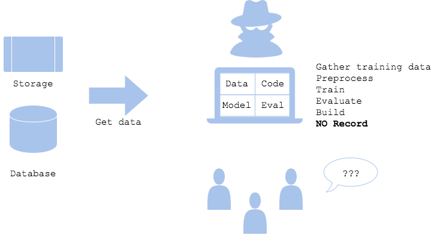

# Only-me pattern

## Case
- MLエンジニアが個人環境で開発し、開発プログラム、データセット、モデル、評価を他者がレビュー、再現できない状態。
- MLエンジニアが個人環境で開発したモデルのみを提供し、正常な実行方法や評価方法が不明な状態。

## Situation
モデルを個人LaptopのJupyter Notebookで開発するケースは多いです。モデルを本番システムに組み込むためにはモデル開発に使用したコードやデータ、環境（OSのバージョン、言語のバージョン、依存ライブラリのバージョン…）を開発環境同様に構築する必要があります。同じ環境でないと開発時同様のパフォーマンスを出せない可能性があるからです。ライブラリによってはバージョン間互換性が担保されず、マイナーバージョンが違うだけで実行できなくなる（または実行できるけどパフォーマンスが変わる）場合があります。そうした状況を避けるためには、モデル開発環境をMLエンジニア以外のエンジニア（ビルドエンジニア、アプリエンジニア、バックエンドエンジニア、SRE等々）に共有する必要があります。 
オンリー・ミー・パターンでは全てのモデル開発をMLエンジニアの個人環境で実施し、個人環境に完全に依存したモデルが完成します。完成したモデルを本番環境で正常に稼働させるためには、MLエンジニアの個人環境を再現することになります。そのためにはMLエンジニアの言語やライブラリやバージョン等を入手し構築する必要がありますが、なにかの拍子に更新をかけてしまった場合、再現不可能になるリスクもあります。 
モデルを本番環境で稼働させるにはプログラムも必要です。UIやAPI等はアプリエンジニアやバックエンドエンジニアが開発可能ですが、MLモデルを稼働させるためのコードは、入力データや前処理、後処理の整合性を取るためにMLエンジニアの開発やサポートが必要になります。本番導入にあたって、モデルの受け入れ段階でコードレビューを行い、エンジニア間でモデルやシステムの実行ロジックを相互に理解すると良いでしょう。

## Diagram

## Pros
- MLエンジニアは自分の使いやすい環境で開発可能。

## Cons
- モデルを本番環境で正常稼働させることが困難になる。

## Work around
- モデル開発と本番システムで共通のOS、言語、ライブラリのバージョンを揃えて開発する。
- Dockerや共通基盤を活用して開発する。
- 開発プログラムをレポジトリで管理し、コードレビューを行う。

## Related design pattern
- [Batch training pattern](./../../Batch-training-pattern/design_ja.md)
- [Pipeline training pattern](./../../Pipeline-training-pattern/design_ja.md)