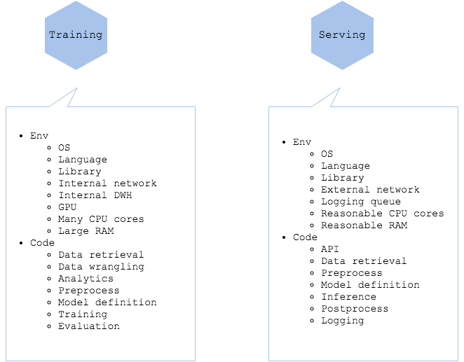

# Training code in serving pattern

## Case
- 学習でしか使わないコードが推論器に残っている状態。
- 実験や評価のためのロジックが推論器に残っている状態。
- 学習や実験、評価のための環境設定が推論器に残っている状態。

## Situation
機械学習の開発（学習や検証、評価等、本番の推論器にリリースする前の段階）で書くロジックやコードが推論器で使うロジックやコードと異なることは多いと思います。コードが違えば依存するライブラリが違うこともあるでしょう。例えば学習であればデータ分割やバッチ学習、パラメータチューニング等のコードを実装しますが、推論でこれらのコードを使うことは稀です。学習と推論で違ったロジックやコードを使う点は機械学習をシステムに組み込む際の課題の一つです。本番システムの開発では、可能な限り不要なコードを含めない（リリースしない）ことで、更新範囲の決定や障害対応の切り分けが簡単になります。機械学習の推論器開発では、学習や検証、評価でしか使わないコードやライブラリは推論器に含めないほうが無難でしょう。 
学習で使うリソース（CPU、GPU、RAM、ネットワーク、ストレージ等）が推論器で使うリソースと違うことがあります。Webサービスであれば、おそらくネットワークとストレージは学習環境（社内）と推論環境（Web向け）で全く異なる構成になるでしょう。また、ディープラーニングの場合、学習でGPUを活用しつつ、推論ではCPUを使う（または学習で学習用GPUを活用しつつ、推論では推論用GPUを使う）ということもあります。こうした理由により、学習環境で使うリソースの設定値は推論器では不要（または害悪）になることがあります。推論器で無効な設定値であれば良いですが、有効に使える設定値の場合、本番稼働する推論器で障害を起こす原因になることがあり、注意が必要です。 
機械学習では学習と推論で異なる環境が使われることが一般的です。他方で、モデルを正常に稼働させるために（学習、評価時と同等のパフォーマンスを推論で発揮するために）、学習と推論でOSや言語、ライブラリ、前処理等を共通化する必要があります。学習と推論で共通化する部分と環境固有になる部分は区別することが重要です。

- 学習と推論で共通にしたほうが良い部分：
  - OS、言語、ライブラリのバージョン。
  - 推論に関わるコードやロジック（前処理、推論実行、後処理）。
- 個別に設定される部分：
  - 学習、検証、評価のコード。
  - 学習のためのライブラリやリソース（学習用GPU、大量のCPUやRAM、社内ネットワーク、社内向けDWH）。

## Diagram

## Pros
- バッチ推論を行う場合は学習と推論で類似した環境が使えることがある。

## Cons
- 学習と推論のコードやライブラリの整理が手間。

## Work around
- 学習と推論でコードや設定を分割することが難しかったとしても、コストやセキュリティ、機密情報に関わる部分（ネットワークやデータへのアクセス等を含む）だけは必ず分離したほうが良い。

## Related design pattern
- [Serving patterns](./../../Serving-patterns/README.md)
- [Training patterns](../README.md)