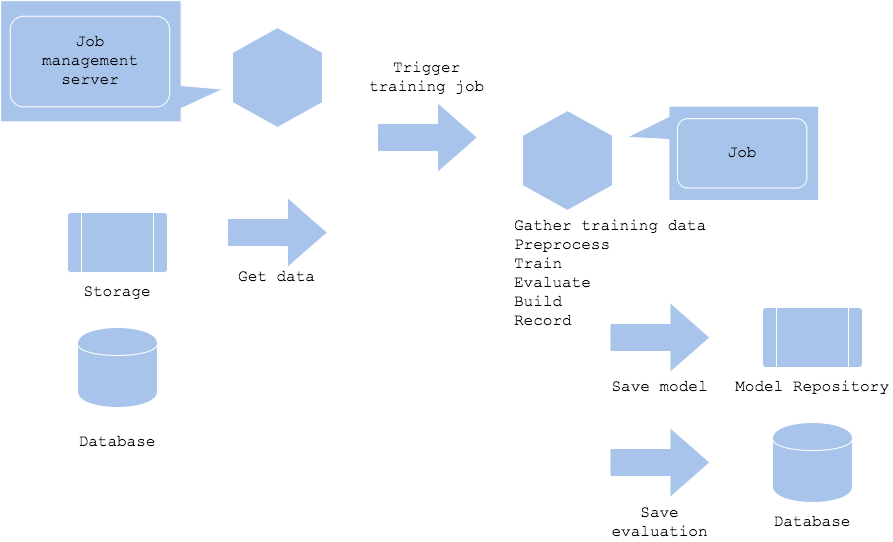

# Batch training pattern

## Usecase
- To train on batch.
- To schedule the batch.

## Architecture
If you need to train your machine learning model regularly, the batch training pattern is applicable. In the pattern, you will define the training as a batch job and configure the trigger and schedule in a job management server. The server will execute the batch job. One of the easiest ways to define it is with Linux crontab, and it is also possible to make it with services in cloud. Or, it is possible to use a job management server. 
The pattern is one of the most common architecture to train a model offline. The workflow would be like:
1. Retrieve data from DWH (may need data cleansing)
2. Preprocess data
3. Train
4. Evaluate
5. Build model to prediction server
6. Store the model and server, and record the evaluation

You may need to consider error handling of each step with the service level objective. 
If you need to keep updating the prediction model everyday or every batch, which means the service level is quite high, you would need retry policy for errors, or send an alert to an operating team. If you don't have to keep updated, you may just alert or record an error, and rekick later. 
It is recommended to make it possible to record failed job and rekick or troubleshoot from the log. Among the workflow above, there may have an irregular or unexpected data in the DWH, such as integer saved as char or invalid value range, that require some data anomaly filtering or data cleansing. It is difficult to rerun the job if there is anomaly data. You may need to filter the data beforehand or manually exclude it. 
For the steps 2. to 4., there may have possibility of the model evaluation may not be good enough for production use. In that case, you may need to reconsider preprocess or hyperparameter of the training and tune them to fit to the current dataset. 
For the 5. and 6., it may be system issue of building or recording error. You may need to review the system components, server, storage, database, network, middleware and so on, to find the root cause and mitigation. 

## Diagram

## Pros
- Retrain and update model regularly.

## Cons
- Need to consider job error.
- It is difficult to make a full-automatic workflow.

## Needs consideration
- Job management method or software.
- Error handling.
