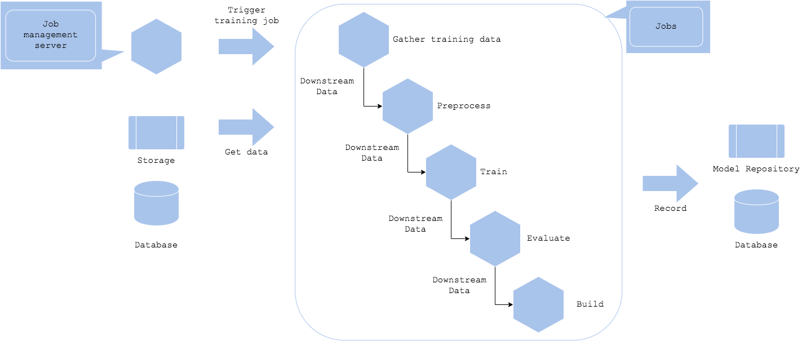

# Pipeline training pattern

## Usecase
- When you need to separate each step of the training pipeline to make it possible to select library on its own and reusable.
- In order to make retry easier with recording status and process in each job.
- To control each job separately.

## Architecture
The pipeline training pattern is a advancement of the batch training pattern. Each job is defined as separate resources, server, container, or worker, to make it possible to deploy the job resource independently to run and retry the job flexibly. Since the job will be deployed as a separate resource, it will be executed after the dependent job. The result of the former job will be succeeded to the latter as its input data. For sake of fault tolerance, the processed data can be stored in DWH. You don't have to run the job right after the former job completion. It is possible to run the time-consuming job frequently, and other jobs not so often. 
Note that the pattern may make the job workflow and resource management complex. While it increases independency of the job, you need to select resource and define jobs.

## Diagram

## Pros
- Possible to define job and select library flexibly.
- Fault isolation.
- Manage job based on workflow or data.

## Cons
- You need to manage multiple jobs in multiple structure.
- System and workflow may be complex.

## Needs consideration
- Resource management, library management and version management.
